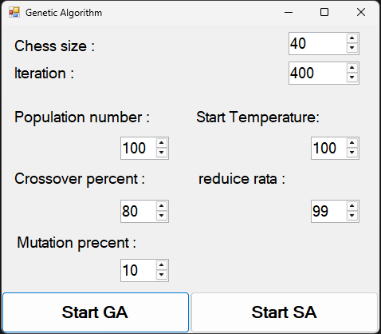

# N-Queens Solver – Genetic Algorithm & Simulated Annealing

A C# implementation of the classic **N-Queens Problem**, solved using two metaheuristic optimization methods:  
- **Genetic Algorithm (GA)**  
- **Simulated Annealing (SA)**  

The project includes a simple GUI to configure parameters (chess size, iterations, population, crossover/mutation rates, and annealing schedule) and run either GA or SA to search for valid solutions.

---

## The N-Queens Problem
The **N-Queens Problem** asks:  

> Place N queens on an N×N chessboard so that no two queens threaten each other (no two queens share the same row, column, or diagonal).  

It is a well-known **constraint satisfaction problem** and a benchmark for optimization and search algorithms.

---

## Algorithms Implemented

### Genetic Algorithm (GA)
- **Population-based search**  
- Candidate solutions encoded as chromosomes (queen positions)  
- Operators:
  - **Selection** – choose parents  
  - **Crossover** – combine parent chromosomes using a position mask  
  - **Mutation** – swap queen positions randomly  
- **Elitism and diversity control**: removes duplicates, preserves best solutions  

### Simulated Annealing (SA)
- **Single-solution based search**  
- Uses a temperature schedule:
  - High temperature → allows worse solutions (exploration)  
  - Low temperature → converges to better solutions (exploitation)  
- Mutation: swap two queen positions  
- Acceptance criterion based on probability `exp(-Δ/T)`  

---

## Features
- GUI with configurable parameters:
  - **Chess size (N)**  
  - **Number of iterations**  
  - **Population size (for GA)**  
  - **Crossover and mutation rates (for GA)**  
  - **Initial temperature & cooling rate (for SA)**  
- Start either **Genetic Algorithm** or **Simulated Annealing** at the click of a button.  
- Displays the **best solution found** and its conflict cost.  

---

## Example GUI
  
*Example interface with GA and SA configuration options.*  

---

## Example Usage

**GA Run (N = 8):**
Chess size: 8
Population: 100
Crossover: 80%
Mutation: 10%
Iterations: 200

**Output:**  
Best solution found with cost = 0
Valid 8-Queens arrangement discovered.


**SA Run (N = 8):**
Chess size: 8
Iterations: 200
Start Temperature: 100
Cooling Rate: 0.99

**Output:**  
Best solution found with cost = 0
Valid 8-Queens arrangement discovered.


---

## Prerequisites
- **.NET Framework / Visual Studio**  
- Basic understanding of:
  - Metaheuristic algorithms (GA, SA)  
  - Constraint satisfaction problems  
  - C# programming  

---

## How to Run
1. Clone the repository:
   ```bash
   git clone https://github.com/your-username/NQueens-GA-SA.git
2. Open the solution in Visual Studio.
3. Build and run the project.
4. Configure parameters in the GUI.
5. Choose Start GA or Start SA to run the solver.

## Applications
- Demonstration of evolutionary and probabilistic algorithms.
- Educational tool for AI & optimization courses.
- Benchmarking GA vs. SA on the same problem.
- Extensible to larger N or hybrid approaches.
